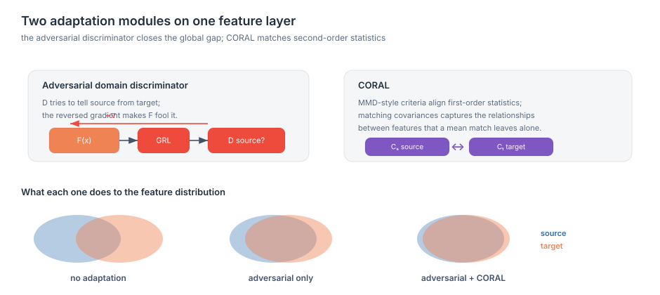
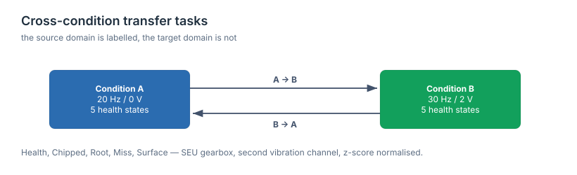

[README.md](https://github.com/user-attachments/files/30654310/README.md)
[README.md](https://github.com/user-attachments/files/30654308/README.md)# Intelligent Gearbox Fault Diagnosis under Different Operating Conditions via Adversarial Domain Adaptation

> Official implementation of the IEEE ICCIA 2022 paper.

> A hybrid unsupervised domain-adaptation framework (**DCAN** — Deep Coral Adversarial Network) that diagnoses gearbox faults when the operating speed and load shift between training and deployment, and when the target data is completely unlabeled.

<p align="left">
  <a href="https://doi.org/10.1109/ICCIA54998.2022.9737160"></a>
  <a href="https://ieeexplore.ieee.org/document/9737160"></a>
  
  
  
  
  
</p>

**Authors:** [Mohammadreza Kavianpour](https://github.com/kavianpour)¹, Mohammadreza Ghorvei¹, Parisa Kavianpour², Amin Ramezani¹ \*, Mohammad T. H. Beheshti¹

¹ Department of Electrical and Computer Engineering, *Tarbiat Modares University*, Tehran, Iran
² *University of Mazandaran*, Babolsar, Iran
\* Corresponding author

Published in the **2022 8th International Conference on Control, Instrumentation and Automation (ICCIA)**, IEEE.
DOI: [10.1109/ICCIA54998.2022.9737160](https://doi.org/10.1109/ICCIA54998.2022.9737160)

---

## TL;DR

Deep-learning fault classifiers collapse when the machine they were trained on starts running at a different speed or load — the data distribution shifts, and in the real world the new condition has **no labels**. This paper proposes **DCAN**, a one-dimensional CNN coupled with *two* complementary domain-adaptation modules (deep CORAL + an adversarial domain discriminator) that align a labeled *source* operating condition with an unlabeled *target* operating condition. On the SEU gearbox dataset it reports **91.94 % average accuracy** across two cross-condition transfer tasks, beating every shallow and deep baseline tested (Table III).

The three core ideas:

1. **Hybrid (not single) domain matching.** Combining a *second-order statistical* alignment (CORAL) with an *adversarial* alignment extracts more domain-invariant features than either module alone.
2. **Fully unsupervised target.** The source domain is labeled; the target domain is unlabeled and handled with pseudo-label learning, matching the realistic industrial setting.
3. **End-to-end raw-signal pipeline.** Raw z-score-normalized vibration signals go straight into a 1-D CNN — no hand-crafted feature engineering.

---

## Quick start

```bash
git clone https://github.com/<user>/Gearbox-Fault-Diagnosis-DCAN.git
cd Gearbox-Fault-Diagnosis-DCAN
pip install -r requirements.txt

# place the SEU gearset CSV files under ./SEU (see docs/datasets.md), then:
python train.py                          # full comparison table, both directions
python train.py --methods DCAN --runs 3  # proposed method only
```

Results are written to `results/results.csv` and `results/results.json`. Every hyper-parameter lives in [`config.py`](config.py); command-line flags override them for a single run:

```bash
python train.py --methods DCAN --tasks A2B --epochs 50 --device cpu
```

This repository provides a reference implementation of the architecture and the data pipeline described in the paper.

---

## The framework / architecture

DCAN has two cooperating halves. The **condition-identification** half is a 1-D CNN feature extractor plus a gearbox health classifier. The **domain-adaptation** half reduces the distribution gap between the source and target operating conditions using two modules working on the fully-connected features: an **adversarial domain discriminator** and a **deep CORAL** alignment.


*Architecture of the proposed DCAN method (Fig. 1 in the paper). Forward propagation flows left→right through the CNN; three back-propagation paths train the classifier ($L_c$), the domain discriminator ($L_d$), and the CORAL alignment ($L_{coral}$).* © 2022 IEEE — see [LICENSE](LICENSE).

The total objective combines three losses:

$$\mathcal{L} = \mathcal{L}_c + \alpha\,\mathcal{L}_d + \beta\,\mathcal{L}_{coral}$$

where $\mathcal{L}_c$ is the source classification (softmax) loss, $\mathcal{L}_d$ is the adversarial discriminator (binary cross-entropy) loss, $\mathcal{L}_{coral}$ is the second-order CORAL loss, and $\alpha,\beta$ weight each adaptation module. Full equations and the layer table are in [`docs/method.md`](docs/method.md).

**A note on Table I.** The paper's own architecture table lists convolution layers C2 and C3 with stride 2, but that is inconsistent with the output sizes on the same row — those sizes (124, 60, and the final flatten of 896) only come out right if C2 and C3 use stride 1. [`config.py`](config.py) works through the arithmetic layer by layer and uses stride 1, which is what reproduces the table's own stated output shape.

---

## Why this is hard

| Challenge | Why it breaks ordinary models | How DCAN responds |
|---|---|---|
| **Shifting operating conditions** | Changing speed/load makes vibration data non-stationary and shifts its distribution, so a model trained on one condition mispredicts on another. | Aligns source and target distributions in latent space instead of assuming they match. |
| **No labels in the target domain** | Real deployments cannot label faults on the live machine; supervised fine-tuning is impossible. | Unsupervised domain adaptation + pseudo-labeling — the target needs no labels. |
| **First-order alignment isn't enough** | MMD-style methods only match means (first-order statistics), leaving correlation structure misaligned. | CORAL matches **second-order** statistics (covariance), capturing feature correlations. |
| **A single alignment module leaves a residual gap** | One matching criterion captures only part of the discrepancy. | Two modules (statistical + adversarial) jointly squeeze out more domain-invariant features. |
| **Hand-crafted features don't transfer** | Features tuned for one regime are unreliable in another and need expert tuning. | End-to-end 1-D CNN learns features directly from the raw signal. |

The long form is in [`docs/challenges.md`](docs/challenges.md).

---

## Two key ideas

**1. Deep CORAL — align the *correlation*, not just the mean.** CORAL minimizes the distance between the covariance matrices of the source and target features, so the model matches second-order statistics that mean-based methods (MMD) miss. This is what lets the learned features stay valid across operating conditions.

**2. Adversarial domain discriminator — a two-player game.** A discriminator $D$ is trained to tell source features from target features, while the feature extractor $F$ is trained to *fool* it. At equilibrium, $F$ produces features that $D$ can no longer attribute to either domain — i.e., domain-invariant representations. Stacking this on top of CORAL is the "hybrid" in DCAN.



*Original figure for this repository, illustrating how the adversarial discriminator and CORAL each narrow the gap between the source and target feature distributions — implemented in [`model.py`](model.py) and [`da_losses.py`](da_losses.py).*


*Accuracy on task A → B as the trade-off coefficients $\alpha$ (adversarial) and $\beta$ (CORAL) vary (Fig. 2 in the paper). The peak — 93.6 % — occurs at $\alpha = 1,\ \beta = 0.5$; with $\alpha = \beta = 0$ the model degrades to a plain CNN (80.23 %).* © 2022 IEEE. These are the defaults in [`config.py`](config.py).

---

## Reported results

Table III of the paper evaluates two transfer directions on the SEU gearbox dataset — **task A** (20 Hz, 0 V) and **task B** (30 Hz, 2 V) — against shallow domain adaptation (JDA, DANN), a deep baseline without adaptation (RWKDCAE, CNN), and single-module variants (C-MKMMD, C-CORAL):


*Accuracy (%) under changing working conditions (Table III in the paper).* © 2022 IEEE.

Highlights reported in the paper:

- **91.94 % average accuracy** — the best of all methods compared.
- **+13.07 %** over the plain CNN baseline and **+9.98 %** over RWKDCAE, showing the value of domain adaptation itself.
- **+3.49 %** over the best single-module variant (C-CORAL, 88.45 %), showing the value of the *hybrid* design.
- C-CORAL beats C-MKMMD, suggesting that second-order (CORAL) alignment outperforms MMD here.

This repository provides the model, the loss functions, and the training loop that produce these predictions; it does not include a run that reproduces the table above, so no accuracy claim beyond the paper's own is made here. `train.py` implements `CNN`, `C-MKMMD`, `C-CORAL` and `DCAN`; the shallow `JDA` and `DANN` baselines are in [`classic.py`](classic.py). `RWKDCAE` is a third-party architecture published elsewhere and is not reimplemented — see [`docs/method.md`](docs/method.md).

---

## Dataset

| | |
|---|---|
| **Name** | SEU gearbox dataset (Southeast University, China) |
| **Acquisition** | Drivetrain Dynamics Simulator (DDS), 8 vibration channels |
| **Channel used** | Channel 2 (gearbox sub-dataset) |
| **Operating conditions** | Task A: 20 Hz – 0 V · Task B: 30 Hz – 2 V |
| **Health classes (5)** | C0 Health · C1 Chipped · C2 Root · C3 Miss · C4 Surface |
| **Split** | 80 % train / 20 % test; source labeled, target unlabeled |
| **Preprocessing** | z-score normalization of the raw 1-D vibration signal |



*Original figure for this repository — implemented in [`data.py`](data.py) (`transfer_loaders`, `all_transfer_tasks`).*

The dataset is **not redistributed here**. It is distributed through Google Drive by its original authors, which has no stable direct-download endpoint — see [`docs/datasets.md`](docs/datasets.md) for the manual steps, or use the companion toolkit below.

---

## Repository contents

```
Gearbox-Fault-Diagnosis-DCAN/
├── README.md
├── config.py                     ← every hyper-parameter, in one dataclass
├── data.py                       ← SEU loader, windowing, z-score, transfer tasks
├── model.py                      ← feature extractor, discriminator, GRL, full DCAN
├── da_losses.py                  ← CORAL, MMD, fixed-bandwidth MKMMD
├── methods.py                    ← registry: CNN / C-MKMMD / C-CORAL / DCAN
├── classic.py                    ← JDA and the shallow DANN baseline
├── train.py                      ← training and evaluation driver
├── make_figures.py               ← regenerates the two original explanatory figures
├── requirements.txt
├── assets/
│   ├── dcan_architecture.png     ← from the paper (© IEEE)
│   ├── sensitivity_alpha_beta.png← from the paper (© IEEE)
│   ├── results_table3.png        ← from the paper (© IEEE)
│   ├── adaptation_modules.svg    ← original figure of this repository
│   └── transfer_tasks.svg        ← original figure of this repository
├── docs/
│   ├── method.md                 ← full method, architecture table, training setup
│   ├── challenges.md             ← the real-world problems this work targets
│   └── datasets.md               ← SEU dataset, classes, and transfer-task design
├── CITATION.cff
├── .gitignore
└── LICENSE                       ← MIT for code, CC BY 4.0 for docs, IEEE notice for paper figures
```

---

## Related

For downloading, parsing, and windowing the SEU gearbox dataset as a standalone package — including the Google Drive handshake, the mixed tab/comma CSV format, all eight channels, and both operating conditions — see the companion **seu-gearbox-toolkit**.

---

## Citation

If you find this work useful, please cite the paper:

```bibtex
@inproceedings{kavianpour2022dcan,
  title     = {An Intelligent Gearbox Fault Diagnosis under Different Operating Conditions using Adversarial Domain Adaptation},
  author    = {Kavianpour, Mohammadreza and Ghorvei, Mohammadreza and Kavianpour, Parisa and Ramezani, Amin and Beheshti, Mohammad T. H.},
  booktitle = {2022 8th International Conference on Control, Instrumentation and Automation (ICCIA)},
  year      = {2022},
  publisher = {IEEE},
  doi       = {10.1109/ICCIA54998.2022.9737160}
}
```

---

## License & figures

- **Source code** (all `.py` files) is released under the **MIT License**.
- **Documentation** (all `.md` files and text) and the original figures of this repository are released under **[CC BY 4.0](LICENSE)**.
- **Paper figures** — `assets/dcan_architecture.png`, `assets/sensitivity_alpha_beta.png` and `assets/results_table3.png` — are reproduced from the published IEEE paper and remain **© 2022 IEEE**. They are included for scholarly, non-commercial showcase purposes under the authors' rights and academic fair-use conventions, and are **not** covered by the MIT or CC BY 4.0 licenses above. Any reuse must follow [IEEE's copyright and reuse policy](https://www.ieee.org/publications/rights/index.html).
- The **SEU dataset** is not redistributed here and remains subject to its original authors' terms.

See [LICENSE](LICENSE) for the full three-part notice.
